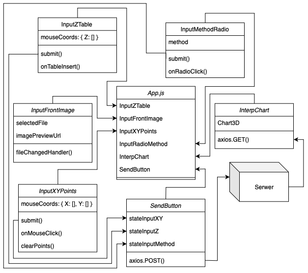

    

***

# Architectural details processing tool

Project which I implemented had automate process the architectural details to 3D objects. On the image I presented the architecture of my tool. 

### Components and Technology

Server group uses the following technologies:
- Python 3.x
- Flask Framework
- CORS
- SciPy module
- NumPy module
- PyMongo module
- Connexion module
- Swagger UI

    

Server component parts (data flow chart is visualise on draw above):
- connect mongo - component to database connection,
- interp result/point - component to perform interpolation algorithm,
- api/cords - component which implement API methods receiver,
- swagger component which visualise user interface for API,
- logger component which log events on server.

Client group uses the following technologies:
- JavaScript
- ReactJS framework
- Axios library
- Redux library
- PlotlyJS library

    

Client component parts (data flow chart is visualise on draw above):
- InputFrontImage - component which input image,
- InputXYPoints - component which input coordinates of selected points,
- InputZTable - component which input Z coordinate,
- InputMethodRadio - component which select method of interpolation,
- SendButton - component which send data to server,
- InterpChart - component which show data visualisation from server response.

Additional thing is using the MongoDB to storage data with non-relational approach.
